# HeyGilli

An AI co-watching buddy for kids' YouTube. Gilli the squirrel watches alongside a child on a tablet or phone, pauses every few minutes to ask a question by voice, and tells the parent at the end of the day what their kid learned. Kids call it by talking to it: "Hey Gilli".

Built for the **Agents for Humans** hackathon (AWS × Devpost), Everyday Agents track, on the **Strands Agents SDK**.

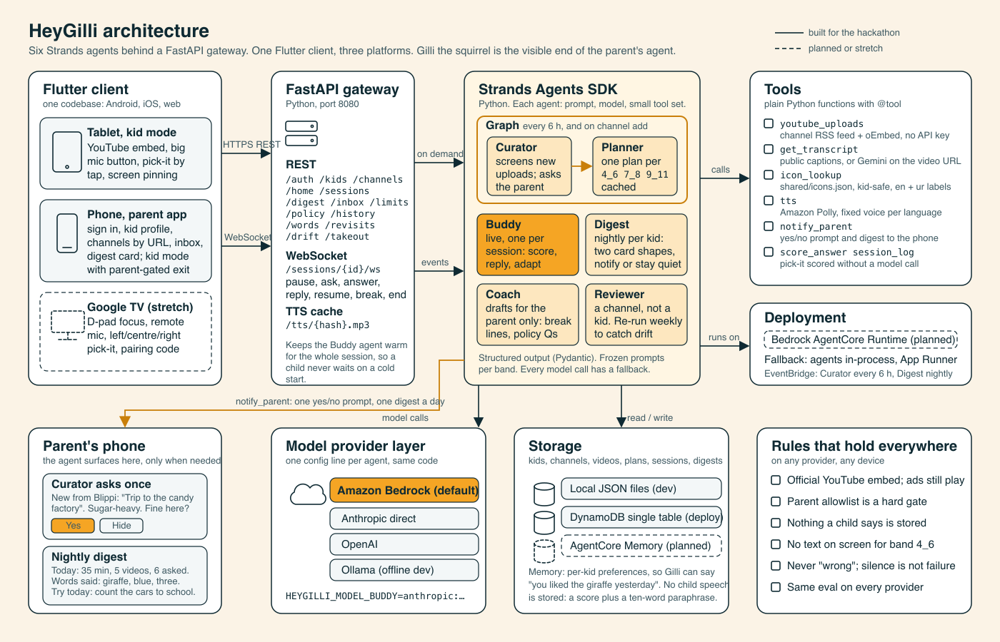

## What it does

| For the child (phone, tablet; TV next) | For the parent (phone) |
|---|---|
| Only parent-approved channels, official YouTube embed, no search, no recommendations | Add channels by URL; kid profile with nickname and age, no child PII |
| At a natural break the video pauses and Gilli asks by voice | The agent screens every new upload in the background and asks the parent only about borderline ones |
| A 4-year-old answers with one word or a tap on one of three pictures; Gilli always models the answer word | A nightly two-line digest: words said for pre-readers, understood and shaky for older kids, one thing to ask at dinner |
| A 9-year-old answers in a sentence, in English or Urdu | Leaving kid mode needs the parent PIN |
| Kid mode is landscape and locks to the app | A Progress screen: minutes a day, whether questions are being answered, words coming back, what needs another look |
| When the day's minutes run out the video stops and Gilli reads out a line **the parent wrote**; no line, and the break is simply quiet | Write those lines yourself. Gilli can draft some, but a draft reaches a child only after you save it, and whether the break holds is your setting |
| One question a session may quietly revisit something they were shaky on, asked as a fresh question about today's video — never first, never two sessions running | A handful of questions about what is actually fine in this house. A "rather not" hides nothing: it routes a matching video to your inbox |
| For an Urdu-speaking household, one Urdu word a session, offered only for something they have just got right in English | An approved channel that has changed raises a card. It is never removed for you — that card has no Approve and no Hide |
| — | Optionally, once, what they have *actually* watched: counts only, and the file and every video title in it are discarded as it is read |

Ads still play and creators still get paid. Nothing a child says is stored; only a score and a ten-word paraphrase.

<p>
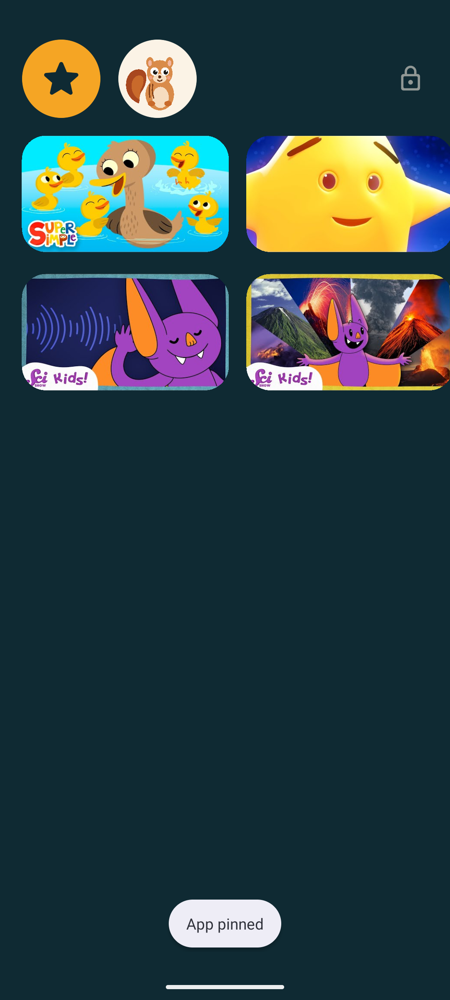
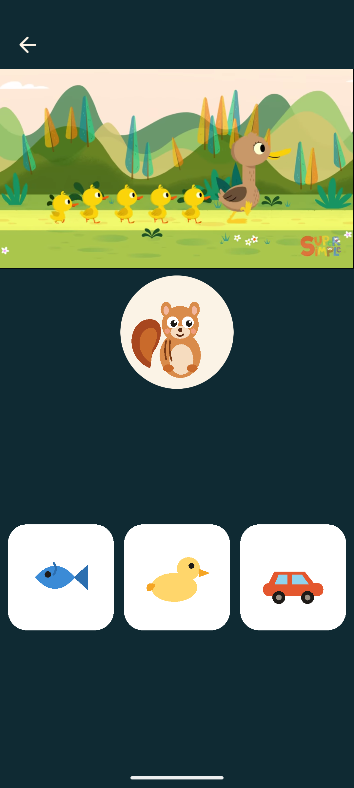
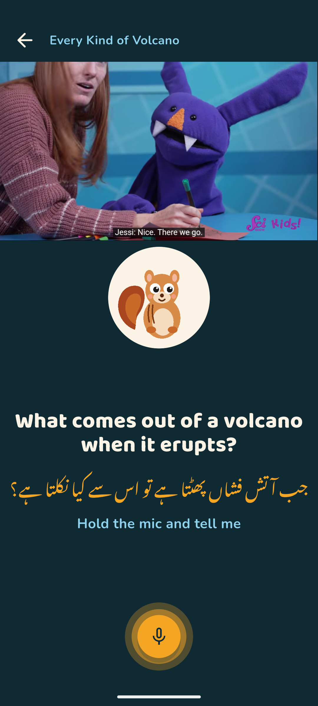
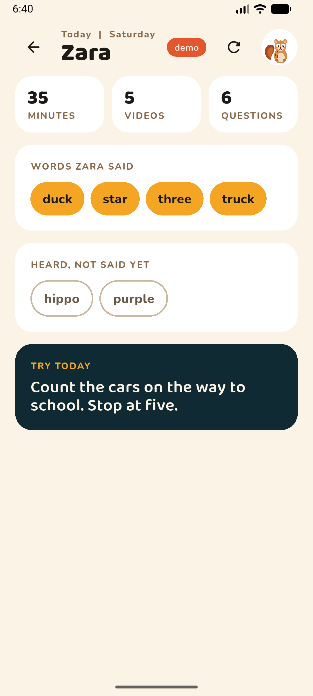
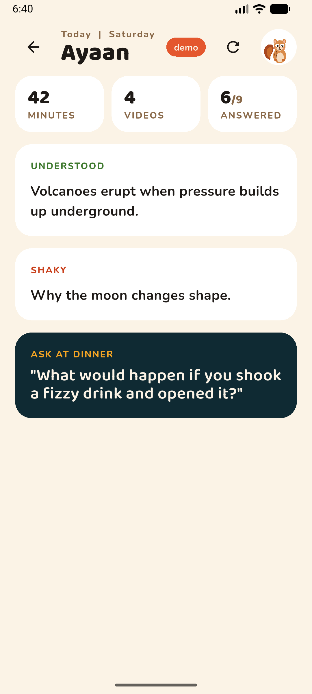
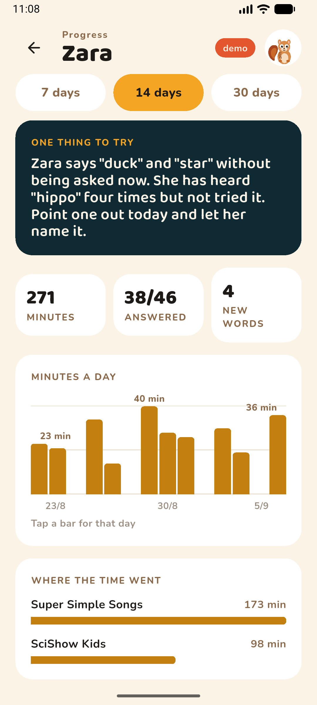
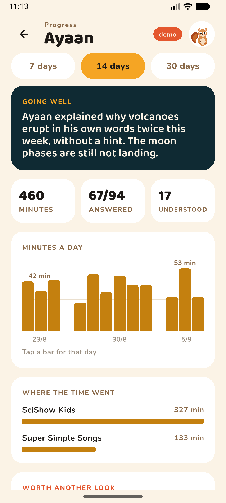
</p>

Live against the gateway on an Android emulator, 5 September: the Curator's approved uploads on a pre-reader's picture-only home, then a Planner question on a real SciShow Kids video, spoken by Polly, and Gilli's reply after the listening window.

<p>
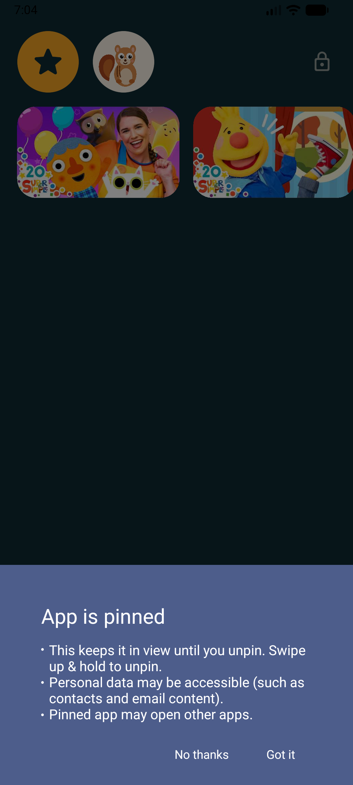
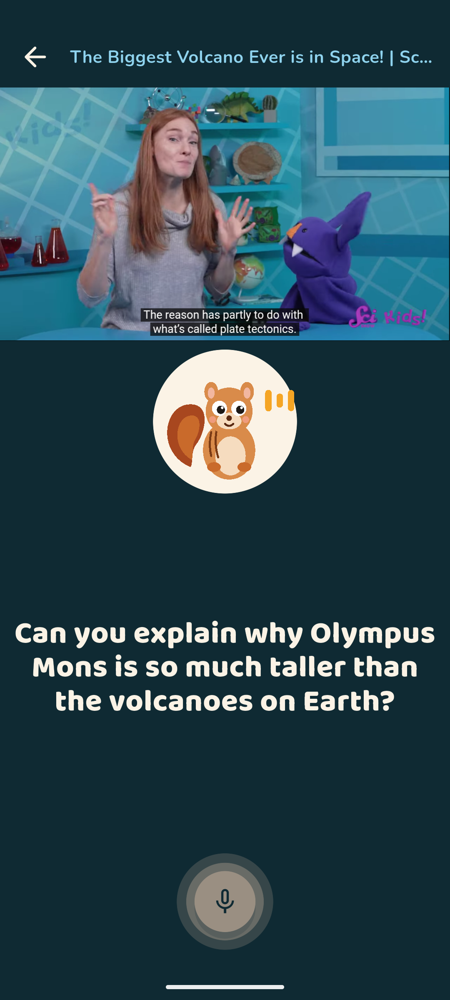
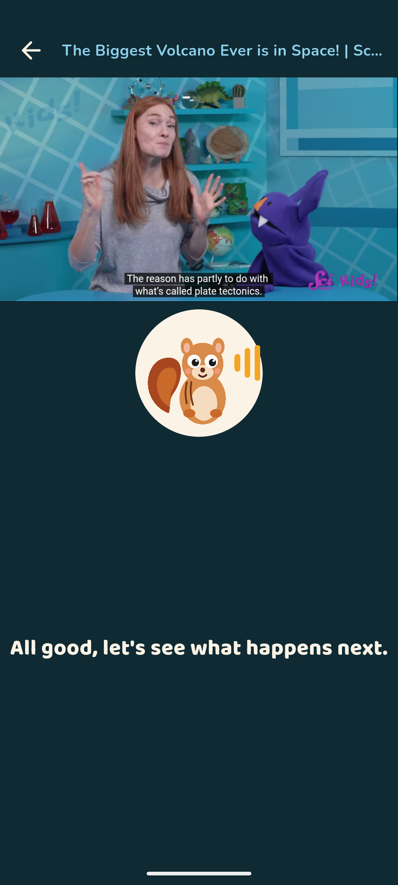
</p>

## How it is built

**Six Strands agents** in Python, each an `Agent` with a frozen system prompt and its own model setting:

| Agent | Runs | `@tool` functions it may call | Decides |
|---|---|---|---|
| Curator | on channel add and on schedule | `screen_video` | approve, hide, or ask the parent |
| Planner | per approved video, per age band and language | `icon_lookup`, `list_icons` | a structured `QuestionPlan`; band and timing rules enforced in code afterwards |
| Buddy | live, one per session over a WebSocket | — | scoring, the reply, and mid-session adaptation |
| Digest | nightly per kid | — | the words a parent reads, and whether anything deserves a notification |
| Reviewer | per channel on import | `screen_video` | what a channel actually publishes, from its RSS feed alone |
| Coach | when a parent writes a break line or sets household policy | — | drafts **for the parent**; nothing here can reach a child |

`ROLES` in `agents/heygilli_agents/models.py` is exactly those six, and each takes its own
`HEYGILLI_MODEL_<ROLE>`. Four further prompts reuse a role's model rather than adding a
seventh: channel drift runs on `reviewer`, the revisit question on `planner`, and the
progress note and watch-history summary on `digest`.

Everything else the pipeline needs — reading a transcript, listing a channel's uploads,
Polly speech, notifying a parent — is a plain function the gateway calls in code, not a
tool handed to a model. The agents decide; the code fetches and enforces.

**Why not a Graph.** SPEC §9.3 sketched Curator → Planner as a Strands `GraphBuilder`
graph, and the installed SDK (strands-agents 1.54) has one. It is not used. Its nodes hand
each other free text, so the Planner would have to re-parse the Curator's prose, and the
§7.3 rule enforcement would sit outside the graph regardless. The hand-off is a typed
Python pipeline instead: the Curator agent makes the judgement call with structured
output, code fans out to the Planner agent per (band, language), and every plan passes
`rules.enforce`. Same agents, deterministic edges, no prose in between.

The FastAPI gateway exposes REST plus one WebSocket per session; the contract is in
[docs/PROTOCOL.md](docs/PROTOCOL.md).

**The model is a setting.** Each agent reads `HEYGILLI_MODEL_<ROLE>=<provider>:<model id>`. Default is Amazon Bedrock in us-east-1; Anthropic direct, OpenAI, and Ollama are one-line alternates with the same code and the same eval (`agents/eval/run_eval.py`).

The client is one Flutter codebase — Android, iOS and web build from it unchanged — with a Google TV layout as the next milestone. Storage is local JSON in development and DynamoDB for deployment.

## Layout

```
app/       Flutter client (Android, iOS, web; phone and tablet layouts)
agents/    Python: Strands agents, tools, FastAPI gateway, tests, eval
design/    Mockup artboards and the design canvas generator
docs/      Architecture diagram, protocol, screenshots, submission docs, video script, runbook
shared/    Icon library shared by planner and client
SPEC.md    Product and technical spec
```

## Run it

Gateway (needs AWS credentials with Bedrock and Polly in us-east-1):

```bash
cd agents
uv venv --python 3.12 && uv pip install -e ".[dev]"
cp .env.example .env
AWS_REGION=us-east-1 HEYGILLI_MODEL_DEFAULT=bedrock:us.amazon.nova-pro-v1:0 HEYGILLI_POLLY_VOICE=Ivy \
  uv run python -m uvicorn heygilli_agents.gateway:app --host 0.0.0.0 --port 8080
```

Tests and the provider eval:

```bash
cd agents
uv run pytest -q && uv run ruff check .
HEYGILLI_MODEL_PLANNER=fake: uv run python eval/run_eval.py
HEYGILLI_MODEL_PLANNER=bedrock:us.amazon.nova-pro-v1:0 AWS_REGION=us-east-1 uv run python eval/run_eval.py
```

App, live against the gateway. Android, iOS and web all build from this one
codebase, and each already knows how to reach a gateway on the same machine —
the Android emulator through its own NAT at `10.0.2.2`, the others at
`localhost` — so no define is needed for a local run:

```bash
cd app
flutter run -d emulator-5554                                   # Android
flutter run -d "iPhone 17 Pro"                                 # iOS simulator
flutter run -d web-server --web-port 5601                      # web
```

Point it at a gateway somewhere else — a real phone on your wifi, or a deployed
one — with the define. It is `HEYGILLI_API_URL`; `HEYGILLI_BASE_URL` is read by
nothing, and a build carrying it silently talks to the default instead:

```bash
flutter run --dart-define=HEYGILLI_API_URL=http://192.168.1.20:8080
```

Google sign-in needs the **web** OAuth client id at build time, on every
platform (Android needs it before Google will issue a server auth code at all).
Without it the button renders and is disabled, and says so:

```bash
flutter run \
  --dart-define=HEYGILLI_API_URL=http://10.0.2.2:8080 \
  --dart-define=HEYGILLI_GOOGLE_SERVER_CLIENT_ID=<web client id from agents/.env>
```

A browser takes a different route to the same place. GIS will not let an app
authenticate from its own button, and its identity button returns only an
id_token — the YouTube scope would then need a second popup, and a second tap,
for something the parent has already agreed to. So the web goes straight to the
authorization-code flow, which asks for the account and the scope in one
window. The code it returns is exchanged exactly as a phone's is. One button,
one popup, everywhere.

For that button to work, the page's exact address must be listed under
**Authorized JavaScript origins** on the web OAuth client (Google Cloud console
→ Credentials). For a local run that is `http://localhost:5601`, which is why
the port is pinned rather than random. Registered on 6 September; Google
answers `401 invalid_client — no registered origin` without it, and HeyGilli
shows nothing at all afterwards, because that refusal happens inside Google's
popup and the SDK does not report it back.

An unregistered origin has a second symptom worth knowing, because it does not
look like a configuration problem: the SDK renders an unverified fallback
button that ignores `locale` and comes out in the browser's or the account's
language. Once the origin is registered the button honours the setting and
reads "Continue with Google".

App, demo mode with no gateway (canned videos, plans and digests, built around
whichever kid you add; a "demo" badge is shown). An unreachable gateway is never
silently swapped for this — demo data ships only when asked for at build time:

```bash
cd app
flutter run --dart-define=HEYGILLI_DEMO=true
```

The iOS and web icons are generated rather than checked in by hand:

```bash
sh app/tool/gen_platform_icons.sh      # needs librsvg + imagemagick
```

Full demo click path: [docs/demo-runbook.md](docs/demo-runbook.md). Agent service details: [agents/README.md](agents/README.md).

## Status

Nine-day build for the 14 September 2026 deadline.

**Verified:** 367 backend tests and 249 client tests, both offline; `flutter analyze` clean. The
Planner on a real SciShow Kids video via its public captions; the Curator screening real uploads
from two channels; a full live session turn on Bedrock with Polly audio. The client runs live
against the gateway on **all three platforms** — Android emulator, iPhone 17 Pro simulator and
Chrome — and in demo mode.

The five agent features added after the core loop (household policy, opt-in watch history, channel
drift, revisits, Urdu word seeding) are specified in `docs/PROTOCOL.md` v1.7, described in SPEC 7.6,
and were each walked through on a device against the running gateway rather than only in tests.

**Anthropic models on Bedrock are still gated** on this account pending the use-case form, so the
interim default is Amazon Nova Pro and every feature falls back to a deterministic built-in when a
model call fails. Nothing in the product is currently showing Anthropic output. The switch back is
one environment variable.

**Not built:** Google TV layout, AgentCore Runtime deployment (documented in `agents/README.md`),
Gemini transcript path (no key on the build machine), EventBridge schedules. Google sign-in on the
web reaches Google's own "not available on this platform" path — google_sign_in's web plugin wants a
rendered button rather than the phone flow — so a browser run uses demo mode or a gateway token.

## Honest notes

- The YouTube embed is used as-is. HeyGilli never blocks ads, downloads video, or draws over playback while it plays.
- Public captions are read with `youtube-transcript-api`; a video-understanding model that accepts YouTube URLs is the other path inside the same tool.
- Speech recognition runs on the device. The backend receives a transcript, scores it, and keeps only the result and a short paraphrase.

## License

MIT. See [LICENSE](LICENSE).
