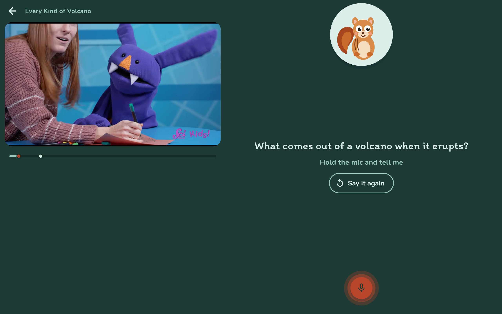
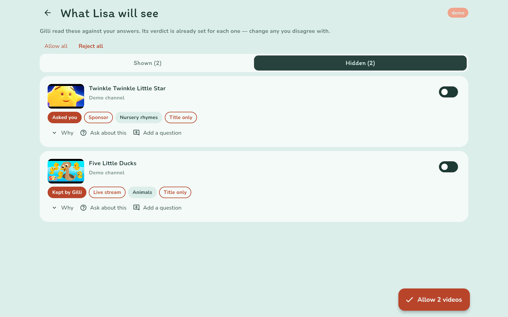
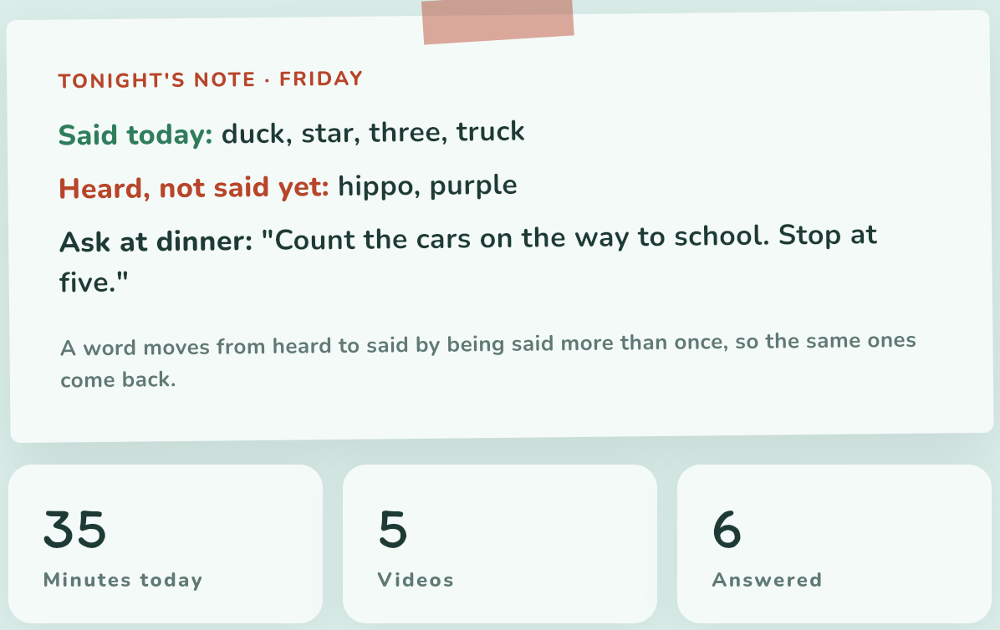

# Agents for Humans: building HeyGilli, part 1 — the concept

**In short:** kids watch a lot of YouTube, and nobody asks them anything. HeyGilli is a co-watching buddy. Agents screen every new upload against the family's own rules, and Gilli the squirrel pauses at natural breaks to ask the child a question. Try the screening, no sign-up: heygilli.com/try.

This is part 1 of 3 on how we built it. Part 2 is the design: eight agents on the Strands Agents SDK. Part 3 is how we made them trustworthy.

## The problem

Parental controls decide what a child may see, and then do nothing. A parent who wants more has two options: watch every video, or read every new upload before it plays.

That second job never ends, and most of the time the answer is obvious. It is a job for an agent, as long as it asks the parent when the answer isn't obvious.

## The concept

**For the parent:** answer a few questions about what is fine in your house. From then on, every new upload on your channels is read against those answers. Clear cases are settled for you. Borderline ones come to you with a reason. Each night there is a short digest, with one question to ask at dinner.

**For the child:** a shelf of approved videos only, with no search and no recommendations, played in the official YouTube player. At a natural break Gilli pauses and asks one question by voice. The child talks or taps a picture, Gilli replies, and the video carries on.

## An agent, not an app

A good agent works in the background and comes to a human only when there is a real decision to make. We wrote this table before any code:

| The agent does this on its own | It asks the parent only when |
|---|---|
| Reads every new upload and writes Gilli's questions | An upload is borderline |
| Runs the whole co-watching session: pause, ask, listen, reply, resume | An approved channel starts publishing something different |
| Writes the nightly digest | The day's time limit runs out mid-video |

Every row on the right is an interruption in a parent's day, so each one had to earn its place.

## Five rules that shaped everything

1. **Suggest, never enforce.** Agents draft and ask; only the parent decides. HeyGilli never removes a channel on its own.
2. **Every agent has a safe way to fail.** When a model call fails, the agent falls back to something safe. Part 2 shows why this mattered.
3. **Nothing a child says is stored.** Only a score and a ten-word paraphrase are kept.
4. **Never mock.** A wrong answer gets curiosity, not correction.
5. **Say what you don't know.** If a video can't be read, it is judged on its title, and the parent sees "title only".

## What shipped

The web app at heygilli.com, built in Flutter, also runs on Android and iOS. Behind it are eight Strands agents on Amazon Bedrock, Gilli's voice from Amazon Polly, and data in Amazon DynamoDB.

**Next, in part 2:** why we built eight small agents instead of one big one, and what happened when the model we planned around turned out to be one our account couldn't call.

Code: https://github.com/mujahidmasood/heygilli. MIT.
