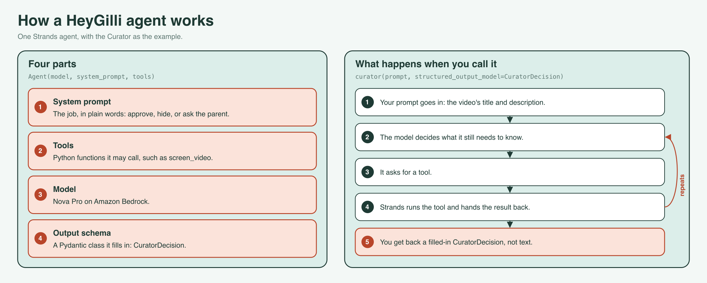
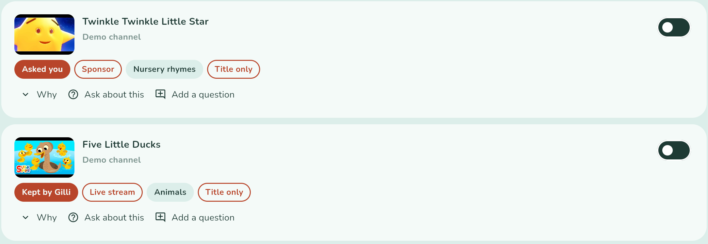

# Agents for Humans: building HeyGilli, part 2 — designing eight agents with Strands

Part 1 was the idea. This part is the design, and how to build one of the agents yourself. It covers the eight small Strands agents, what one of them is made of, a five-step build of the Curator, the multi-agent pattern we skipped, and the day our planned model turned out to be one we couldn't call.

## One agent per job

Instead of one assistant with twenty tools, each agent has one trigger, one output type, and a short tool list:

| Agent | Runs | Decides |
|---|---|---|
| Curator | when a channel is added, and on a schedule | approve, hide, or ask the parent |
| Planner | once per approved video and language | the questions Gilli asks |
| Buddy | live, one per session | how an answer scores, and Gilli's reply |
| Digest | nightly | the parent's note |
| Reviewer | when a channel is imported | what a channel really publishes |
| Coach | when a parent sets house rules | drafts for the parent only |
| Explainer | when a parent asks about a video | nothing: it answers, it doesn't rule |
| Playmate | each round of Gilli's games | how hard the next round is |

Only three of them have tools. Everything else, like fetching a transcript, listing uploads or generating Polly speech, is a plain Python function the gateway calls. That became the rule for the whole codebase: **the agents decide; the code fetches and enforces.** A model that can't reach the database can't corrupt it, and a rule written in code can be unit-tested.

## What an agent is made of



Every HeyGilli agent is a Strands `Agent` made of four parts:

- **a system prompt**, which describes the job in plain words;
- **tools**, which are plain Python functions it may call;
- **a model**, chosen per agent by a setting;
- **an output schema**, a Pydantic class it must fill in.

When you call the agent, Strands runs the loop for you. The model reads the prompt, asks for a tool if it needs one, Strands runs that function and hands back the result, and the model answers. Strands then returns the answer as an object of your schema, not as text.

## Build one yourself, in five steps

Here is the Curator, which decides whether a new upload is right for a child. The code is the same as in the repo, trimmed.

**1. Install Strands.** It works with Amazon Bedrock out of the box.

```bash
pip install strands-agents pydantic boto3
```

**2. Write a tool.** A tool is an ordinary function with `@tool` on top. Its docstring is all the model knows about it, so say what it does, what goes in and what comes out.

```python
from strands import tool

@tool
def screen_video(title: str, description: str = "", duration_s: int = 0) -> dict:
    """Rule-based safety pre-check for a YouTube video before the model reviews it.

    Args:
        title: video title
        description: video description (may be empty)
        duration_s: length in seconds, 0 if unknown

    Returns:
        {"verdict": "pass"|"hide"|"ask_parent", "reason": str}
    """
    return prescreen(title, description, duration_s)  # plain rules, no model
```

**3. Define what the agent returns.** This is where most of our prompt engineering ended up, because field descriptions are instructions the model sees on every call.

```python
from typing import Literal
from pydantic import BaseModel, Field

class CuratorDecision(BaseModel):
    decision: Literal["approve", "hide", "ask_parent"]
    reason: str = Field(description="Two or three sentences for the parent who has to "
                                    "decide ... Never restate the title.")
    topics: list[str] = Field(default_factory=list)
    concerns: list[str] = Field(default_factory=list,
                                description="Up to 3 short tags, one to three words each, "
                                            "naming what gave you pause.")
```

The `Literal` means the model can't invent a fourth verdict. One line describing `concerns` did more for the parent's screen than a paragraph of system prompt had: it keeps the tags short enough to skim.



**4. Create the agent.** Give it the prompt, the tools and a model.

```python
from strands import Agent
from strands.models import BedrockModel

curator = Agent(
    name="heygilli-curator",
    model=BedrockModel(model_id="us.amazon.nova-pro-v1:0", region_name="us-east-1"),
    system_prompt=CURATOR_SYSTEM_PROMPT,  # "You are the Curator for HeyGilli ... approve,
                                          # hide or ask_parent ..."
    tools=[screen_video],
    callback_handler=None,                # no streaming to stdout inside a server
)
```

**5. Call it, and get an object back.**

```python
result = curator(
    f"Title: {video.title}\nDescription: {video.description}\nTranscript: {excerpt}",
    structured_output_model=CuratorDecision,
)
decision = result.structured_output  # a CuratorDecision, never free text
```

That's a working agent. Three habits turned it into eight production agents:

- **One agent per request.** A Strands `Agent` handles one call at a time, so we build a fresh one per request. It's cheap.
- **The model is an argument.** Every test passes in a fake model, so the tests never need credentials.
- **Every call goes through one guarded function.** It checks the answer in code, sends a broken one back once, and falls back to something safe. Part 3 is about that function.

## A tool's docstring is its whole manual

A Strands `@tool` is still a plain function, so the pipeline calls `screen_video` directly too. That's one implementation with two callers. But we learned how much the docstring matters from a bug.

The Explainer's prompt showed the channel's ID but not the video's, so the model passed the channel ID to `search_transcript`. The search ran against nothing, and "not found" became a confident, wrong answer to a parent. Now both IDs are labelled, the tool rejects a channel ID and says why, and it returns `searched_whole_video` so the agent knows when "not found" can be trusted.

The same prompt treats a transcript as somebody else's content, to be described and never obeyed. That's prompt-injection defence for a product whose whole input is other people's videos.

## The Graph we didn't build

Our spec drew Curator → Planner as a Strands `GraphBuilder` graph. But graph nodes pass text, so the Planner would have re-read the Curator's prose to rebuild a decision that already existed as a typed object. The hand-off is plain code instead:

```python
decided = structured(agent, prompt, CuratorDecision, context={...})
...
if decision.decision == "approve":
    for language in languages:
        ensure_plan(video, band, language, store, planner, ...)  # the Planner, then rules.enforce
```

Our rule of thumb: use a multi-agent topology when you can't name the next step in advance. We always could.

## The model is a setting

Each agent reads `HEYGILLI_MODEL_<ROLE>=<provider>:<model id>`, and one loader turns that into a Strands model: Bedrock, Anthropic, OpenAI, Ollama, or a fake one for tests.

We had planned on Claude on Amazon Bedrock. The inference profiles all listed as `ACTIVE`, but every call failed:

```
ResourceNotFoundException: Model use case details have not been submitted
for this account.
```

Our eval scored **0 of 18** on Claude Sonnet 4.6, **0 of 18** on Claude Haiku 4.5, and **16 of 18** on Amazon Nova Pro. Because the model was a setting, switching took one environment variable. Production runs on Nova Pro today, and moving to Claude is the same one-line change once access is granted.

The lesson: call the model before you trust the console.

## Next

Part 3 covers how we keep a model from saying the wrong thing to a child: one function every call goes through, guardrails with one retry, full traces, and an audit that fixes past mistakes.

Code: https://github.com/mujahidmasood/heygilli. MIT.
