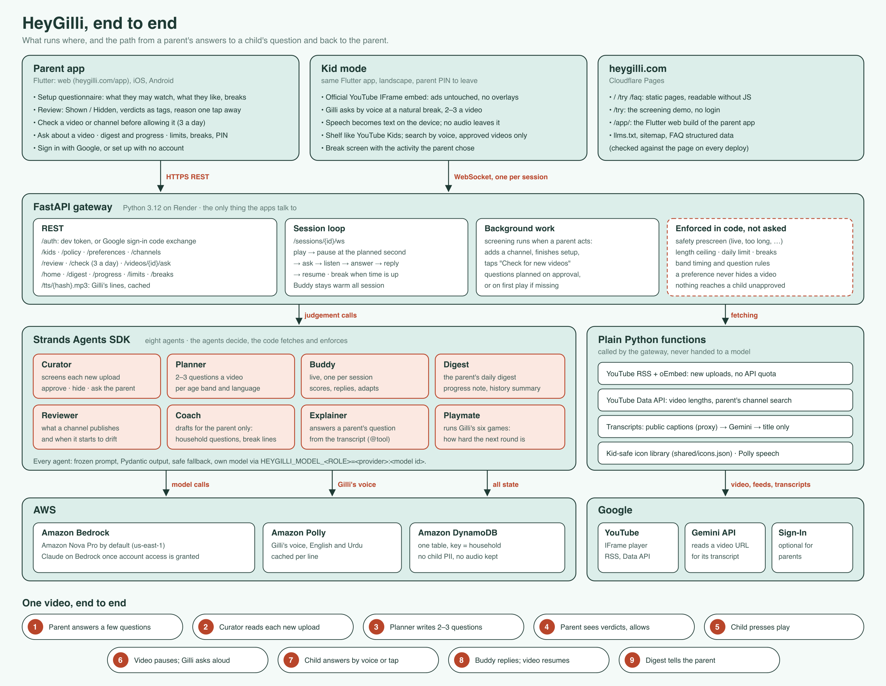

# Agents for Humans: building HeyGilli, part 3 — making the agents trustworthy

[Part 1](https://builder.aws.com/content/3J9lT0BiJ7M7ZwYqX6EbldIShrC/agents-for-humans-building-heygilli-part-1-the-concept-and-the-requirements) was the idea and [part 2](https://builder.aws.com/content/3J9lmlk9RcHyUqdhf08wPp8ZsGZ/agents-for-humans-building-heygilli-part-2-designing-eight-agents-with-strands) the eight Strands agents. This last part answers the question every parent asks first: how do you know it won't say something it shouldn't?

A prompt that says "never say *wrong*" is a request, not a guarantee. What we built catches a bad answer before a child hears it, shows a parent the whole story afterwards, and fixes what was already done.

## One door for every model call

All eight agents reach the model through one function, `structured()`. The live gateway, the tests and the eval all share it, so anything added there applies everywhere:

```python
def structured(agent, prompt, output_model, *, context=None):
    role = agent.name.removeprefix("heygilli-")
    # (tracing and the audit record left out)
    out = _invoke(agent, prompt, output_model)          # Strands structured output
    blocked = guardrails.blocking(guardrails.check(output_model.__name__, out, context))
    if not blocked:
        return out
    retry = _invoke(agent, guardrails.feedback(blocked), output_model)  # once more, with the reason
    if not guardrails.blocking(guardrails.check(output_model.__name__, retry, context)):
        return retry
    raise GuardrailError(role, blocked)
```

## Guardrails, checked in code

Anything a child will hear, such as a question, a reply or a game line, is checked against the child-text rules:

- no unsafe words;
- no personal questions ("what's your name, your school…");
- no links;
- nothing harsh like "wrong" or "you failed".

What only a parent reads is checked for consistency instead. The Curator can't approve a video whose own title trips a safety rule, and the digest can't claim a child said a word no question used.

A broken answer goes back to the agent once, with the rule it broke. The first answer is still in the Strands conversation, so that short message is enough. If the retry fails too, `GuardrailError` is raised. It's a kind of `LLMError`, so every caller's existing fallback catches it: the built-in questions, or asking the parent. The model can fail, but a child never hears it fail.

## Wrap the provider's errors, or your fallbacks never run

This one cost us an outage. When our Bedrock model turned out to be one the account couldn't call (see part 2), botocore raised `ResourceNotFoundException`. That isn't an `LLMError`, so it went straight past every fallback written for exactly this case and became a 500, which the browser reported as a CORS error. The fix is one `try` in the only function that calls the agent:

```python
try:
    result = agent(prompt, structured_output_model=output_model)
except LLMError:
    raise
except Exception as e:  # provider SDK, network, throttling, access
    raise LLMError(f"{agent.name}: {type(e).__name__}: {e}") from e
```

## Traces, audit and auto-fix

- **Full traces.** Strands emits OpenTelemetry spans for every agent run, model call and tool call. We store each trace with the household's data, so it can be read with nothing else deployed and is deleted along with the household. What a child said is replaced before anything is written.
- **Every call is an event.** It records the role, the result, the time taken, whether a guardrail fired, and whether the retry fixed it.
- **The audit looks back.** After each screening it re-checks past decisions against today's rules, and it never touches a decision a parent made:
    - an approval that now breaks a rule is hidden;
    - one that should have gone to the parent goes back to them;
    - a cached question plan holding something a child mustn't hear is dropped.
- **One report.** The gateway's `/agents/report` puts it together: what the agents did, what was caught, and what was fixed, each linked to its trace.

## An eval before any provider is trusted

The eval runs three real transcripts against three sets of question rules in two languages, which makes 18 cells. A cell passes only when the final plan is clean *and* came from the model rather than the fallback. That's where part 2's numbers come from: 0/18, 0/18 and 16/18. Underneath, 723 backend tests run offline on a fake model (alongside 638 Flutter client tests), because the rules they test live in code.



## What runs on AWS

- **Amazon Bedrock** in us-east-1: Amazon Nova Pro for all eight agents while Anthropic access is pending.
- **Amazon Polly**: Gilli's voice.
- **Amazon DynamoDB**: one table keyed by household. Deleting a household deletes everything about it, traces included.

## What we'd tell another team

- **Put every model call behind one function.** Tracing, guardrails, retries and auditing each become a few lines.
- **Check the output in code, then give the model one chance to fix it.**
- **Wrap the provider's exceptions where you call it.**
- **Call the model before you trust the console.**
- **Watch the token ratio, not just the bill.** Ours ran about 32 input tokens for every output token. Agents that read transcripts are input machines.

That completes the series.

Try the screening (no sign-up): https://heygilli.com/try  
Live web app: https://heygilli.com/app  
Code: https://github.com/mujahidmasood/heygilli (MIT)
